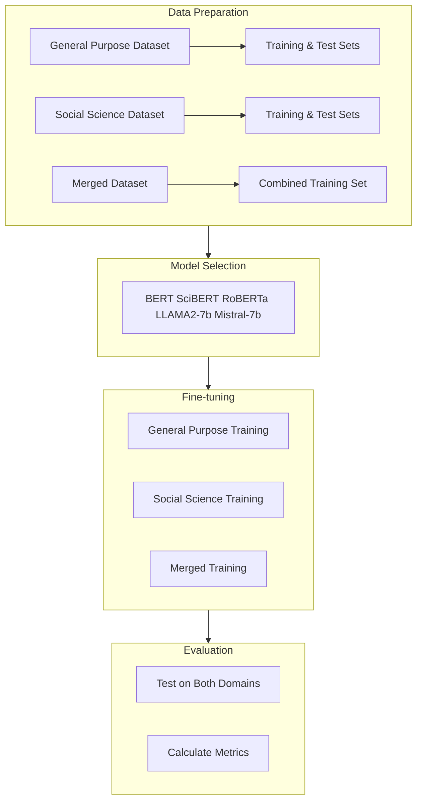
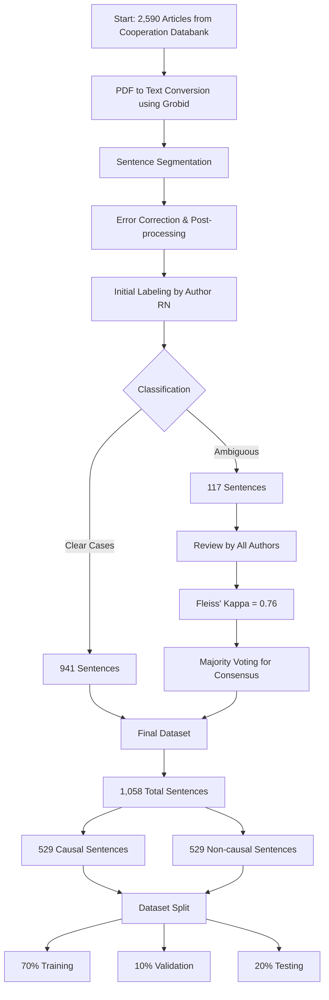

# Causal Sentence Extractor Project

Welcome to the Causal Sentence Extractor repository, designed to facilitate the extraction of causal sentences from social science texts using transformers models.

## Table of Contents
- [Introduction](#introduction)
- [Methodology](#methodology)
- [Datasets](#datasets)
  - [Social Science Data Curation](#social-science-data-curation)
  - [Repository Dataset Files](#repository-dataset-files)
- [Installation and Setup](#installation-and-setup)
- [Usage](#usage)
  - [Getting Started](#getting-started)
  - [Fine-Tuning Models](#fine-tuning-models)
  - [Reproducibility](#reproducibility)
- [Inference with Huggingface API](#Inference-with-Huggingface-API) 
- [Project Structure](#project-structure)
- [Citing This Work](#citing-this-work)
- [License](#license)

## Introduction
This repository contains the resources needed to run, modify, and evaluate the text mining models developed for extracting causal sentences from social science context.
- 📄 [Paper](https://www.cambridge.org/core/journals/research-synthesis-methods/article/capturing-causal-claims-a-finetuned-text-mining-model-for-extracting-causal-sentences-from-social-science-papers/E76E6EFB3373DE4FE6D9DCDB56271CEE?utm_campaign=shareaholic&utm_medium=copy_link&utm_source=bookmark)
  
## Methodology
Our approach combines general-purpose and domain-specific datasets to create robust models for causal sentence extraction. The methodology consists of four main steps:

1. **Data Preparation**: We utilize both general-purpose causal datasets and a custom-curated social science dataset, along with a merged version combining both training sets.
2. **Model Selection**: Five transformer models are evaluated, BERT, SciBERT, RoBERTa Large, LLAMA2-7b and Mistral-7b.
3. **Fine-tuning**: Each model undergoes three training scenarios using general-purpose, social science, and merged training set datasets.
4. **Evaluation**: Models are tested on both general and social science domains test sets to assess performance and domain adaptation.



## Installation and Setup
To set up your environment for full functionality of the tools, please see `research_environment.md`. For optimal performance and reproducibility, using a NVIDIA A100 GPU is essential.

## Datasets
### Social Science Data Curation
Our social science dataset was carefully curated through the following process:


The curation process involved several key steps:

1. **Initial Data Collection**
   - Started with 2,590 articles from the Cooperation Databank

2. **Text Processing**
   - Converted PDFs to text using Grobid
   - Performed sentence segmentation
   - Applied post-processing error corrections

3. **Annotation Process**
   - Initial labeling identified 941 clear cases and 117 ambiguous cases
   - Ambiguous cases underwent review by all authors
   - Achieved substantial inter-rater agreement (Fleiss' Kappa = 0.76)
   - Used majority voting for final consensus

4. **Final Dataset**
   - Balanced dataset of 1,058 sentences
   - Equal distribution: 529 causal and 529 non-causal sentences

5. **Dataset Splitting**
   - Training: 70%
   - Validation: 10%
   - Testing: 20%

### Repository Dataset Files 
The datasets directory contains multiple subsets crucial for training and evaluating the models:

- **ssc_:** ssc_train.csv, ssc_val.csv, ssc_test.csv – Our custom curated datasets.
- **general_:** Datasets compiled from various sources like AltLex, BECAUSE 2.0, CausalTimeBank (CTB), EventStoryLine (ESL), and SemEval 2010 Task 8. These datasets undergo a deduplication process, balancing using undersampling, and are split into general_train.csv, general_val.csv, with general_test.csv remaining unbalanced.
- **all_:** A merged set of the above two categories for extended training and validation (all_train.csv, all_val.csv).


## Usage

### Getting Started
To use this project, first clone the repository and navigate to the project directory:
```bash
git clone https://github.com/rasoulnorouzi/cessc.git
cd cessc
```
Then open the `tutorial_reproducibility.ipynb` to see an example of how to run the code:
````bas
jupyter notebook tutorial_reproducibility.ipynb
````
### Fine-Tuning Models
To fine-tune a model:
1.  Ensure your dataset is in CSV format with `text` and `label` columns.
2.  In the script, specify your dataset's path and name.
3.  Choose the model for fine-tuning from our available models.
### Reproducibility
The provided Jupyter notebook (`tutorial_reproducibility.ipynb`) guides you through the model training and evaluation process. Remember to restart the notebook kernel after each training session to maintain consistency.

## Inference with Huggingface API
To utilize our best model for causal and non-causal classification tailored to the social science context, you can use the Huggingface `pipeline` for easy inference or load the model directly for more customized use. Below are examples demonstrating both approaches, and you can also [check the model directly on Huggingface](https://huggingface.co/rasoultilburg/ssc_bert?text=In+the+beginning%2C+Sonca+seemed+to+have+intensified+rapidly+since+its+formation+%2C+however%2C+soon+the+storm+weakened+back+to+a+minimal+tropical+storm+because+of+dry+air+entering+the+LLCC+that+caused+it+to+elongate+and+weaken.) for quick experiments.

#### Using Pipeline
Run the following example to classify text using our fine-tuned BERT model:

```python
from transformers import pipeline

pipe = pipeline("text-classification", model="rasoultilburg/ssc_bert")

result = pipe("Our findings thus far show that the sanction reduced the number of chips that participants allocated to themselves and that it only increased the number of chips allocated to the yellow pool when there were two options.")
print(result)
# [{'label': 'LABEL_1', 'score': 0.939}]
```
#### Loading the Model Directly
For more advanced use cases, such as processing multiple sentences or integrating into a larger Python project, you can load the model and tokenizer directly:
```python
from transformers import AutoTokenizer, AutoModelForSequenceClassification

tokenizer = AutoTokenizer.from_pretrained("rasoultilburg/ssc_bert")
model = AutoModelForSequenceClassification.from_pretrained("rasoultilburg/ssc_bert")

sequences = [
    "Our findings thus far show that the sanction reduced the number of chips that participants allocated to themselves and that it only increased the number of chips allocated to the yellow pool when there were two options.",
    "First, we can assess the correlation between beliefs and contributions, which we expect to differ between types of players and which helps us to check on the player type as elicited in the P-experiment."
]

tokens = tokenizer(sequences, padding=True, truncation=True, return_tensors="pt")
output = model(**tokens)
print(output)
```

## Project Structure
````
cessc/
├── datasets/
│   ├── ssc_train.csv
│   ├── ssc_val.csv
│   ├── ssc_test.csv
│   ├── general_train.csv
│   ├── general_val.csv
│   ├── general_test.csv
│   └── all_train.csv
├── paper_files/
│   └── <list of LaTeX files and related documents>
├── scripts/
│   ├── configurations.py
│   ├── evaluation.py
│   ├── finetuner.py
│   ├── model_factory.py
│   ├── utility.py
│   └── requirements.txt
├── README.md
├── research_environment.md
└── tutorial_reproducibility.ipynb
````
## Citing This Work
- 📄 [Paper](https://www.cambridge.org/core/journals/research-synthesis-methods/article/capturing-causal-claims-a-finetuned-text-mining-model-for-extracting-causal-sentences-from-social-science-papers/E76E6EFB3373DE4FE6D9DCDB56271CEE?utm_campaign=shareaholic&utm_medium=copy_link&utm_source=bookmark) 

If this project aids in your research, please cite it using the following BibTeX entry:
````
@article{Norouzi_Kleinberg_Vermunt_van Lissa_2025, title={Capturing causal claims: A fine-tuned text mining model for extracting causal sentences from social science papers}, DOI={10.1017/rsm.2024.13}, journal={Research Synthesis Methods}, author={Norouzi, Rasoul and Kleinberg, Bennett and Vermunt, Jeroen K. and van Lissa, Caspar J.}, year={2025}, pages={1–18}} 
````
## License

This project is licensed under the GNU GPLv3, allowing for free use and modification with appropriate attribution.
